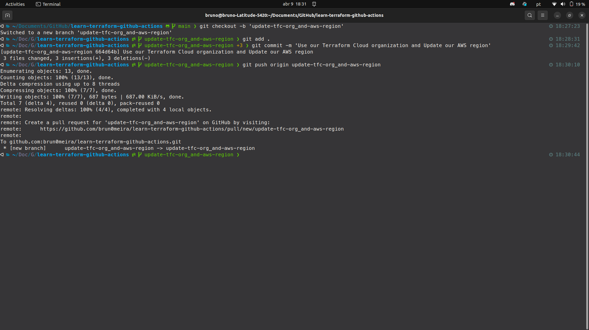
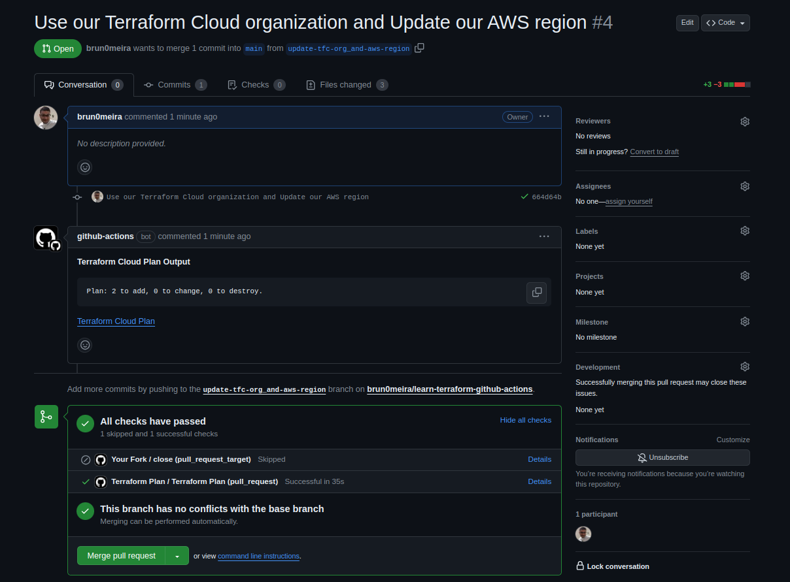
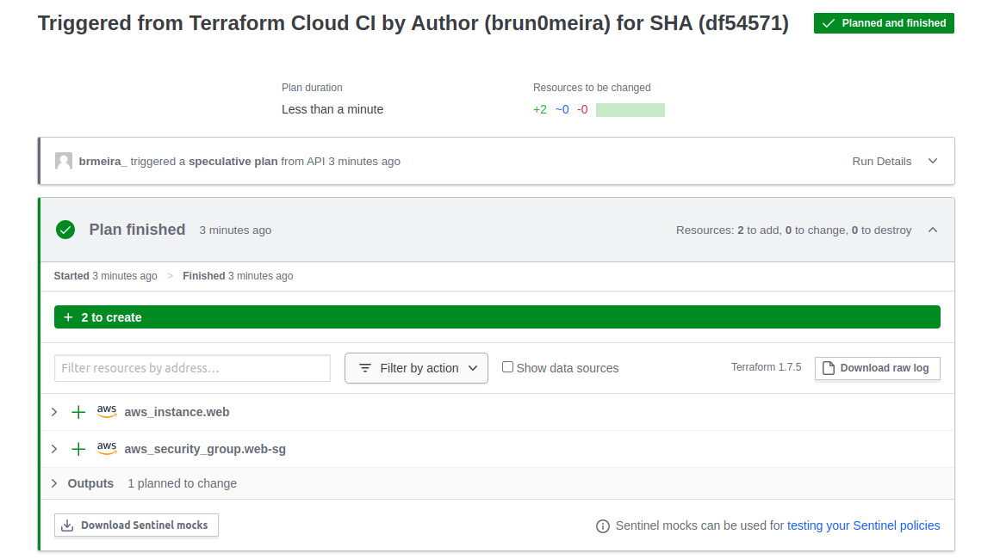
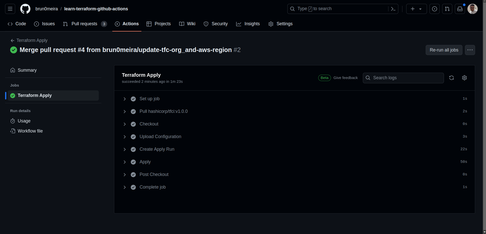
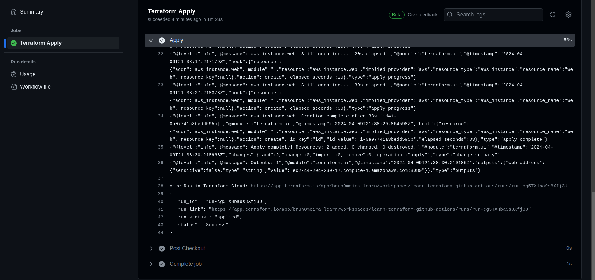
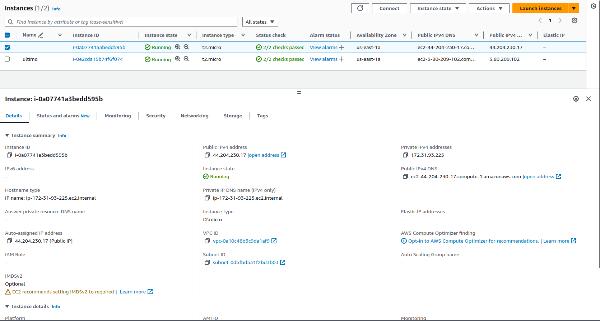
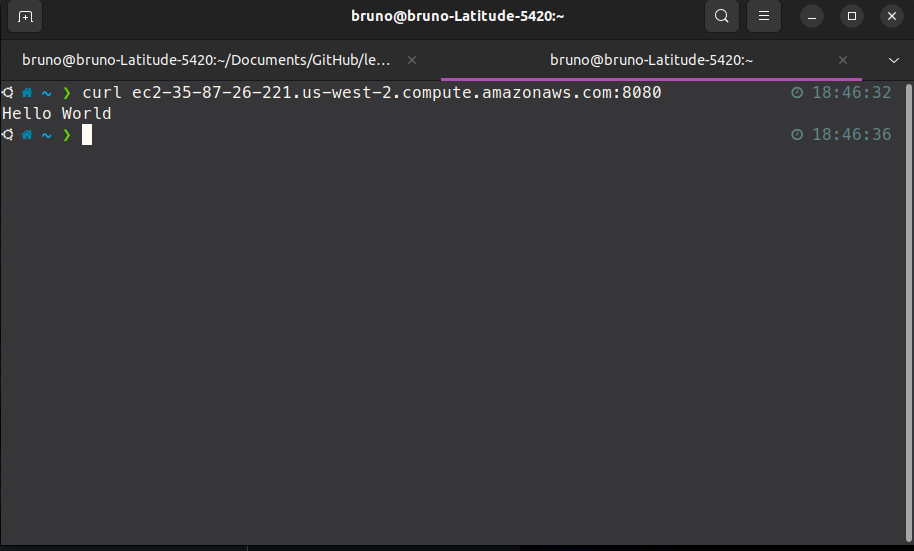

# Automate Terraform with GitHub Actions

This repo is a companion repo to the [Automate Terraform with GitHub Actions tutorial](https://developer.hashicorp.com/terraform/tutorials/automation/github-actions).

# Automate Terraform with GitHub Actions

## Introdução

O artigo demonstra como integrar o Terraform, uma ferramenta de infraestrutura como código (IaC), com o GitHub Actions para automatizar o processo de provisionamento e gerenciamento de recursos na nuvem. O Terraform é utilizado para definir a infraestrutura como código, permitindo que a infraestrutura seja tratada da mesma forma que o software tradicional, facilitando a sua criação, alteração e destruição de forma programática e previsível. O GitHub Actions, por sua vez, é utilizado para automatizar os fluxos de trabalho de CI/CD, promovendo a colaboração e a integração contínua no desenvolvimento de software. Ao realizar essa integração do Terraform com o GitHub Actions, é possível automatizar tarefas como a criação de planos de execução, aplicação de configurações e destruição de recursos, garantindo a eficiência e a confiabilidade no gerenciamento da infraestrutura.

## Tecnologias Utilizadas
- **Terraform**: Utilizado para definir a infraestrutura como código.
- **Terraform Cloud**: Usado para armazenar o estado do Terraform e gerenciar as execuções do Terraform.
- **GitHub Actions**: Utilizado para automatizar os fluxos de trabalho de CI/CD.
- **AWS**: Cloud provider onde são provisionados os recursos.
- **IAM**: Autenticação de usuário usada para autenticar na AWS.
- **GitHub**: Plataforma de hospedagem de código.

## Conceitos Aprendidos
- **Infraestrutura como Código (IaC)**: Utilização do Terraform para definir a infraestrutura como código, permitindo a criação e gerenciamento de recursos de forma programática.
- **Gerenciamento de Estado do Terraform**: Utilização do Terraform Cloud para armazenar o estado do Terraform, garantindo a consistência e o controle da infraestrutura provisionada.
- **Integração Contínua (CI)**: Utilização do GitHub Actions para automatizar os fluxos de trabalho de CI/CD, como a criação de planos e a aplicação de configurações do Terraform.
- **Implantação Contínua (CD)**: Automatização da aplicação de configurações do Terraform após a revisão de pull requests e mesclagem no GitHub.

## Passos Detalhados
1. Configuração do Terraform Cloud:
   - Criação de um novo espaço de trabalho no Terraform Cloud.
   - Adição das credenciais da AWS como variáveis de ambiente no espaço de trabalho do Terraform Cloud.
   - Geração de um token de API do usuário do Terraform Cloud.

2. Configuração do Repositório GitHub:
   - Criação de um novo repositório a partir de um modelo fornecido.
   - Adição do token de API do Terraform Cloud como um segredo no repositório.

3. Revisão dos Fluxos de Trabalho de Ações:
   - **terraform-plan.yml**: Define o fluxo de trabalho para criar um plano Terraform em cada pull request.
   - **terraform-apply.yml**: Define o fluxo de trabalho para aplicar as configurações do Terraform na branch main.

4. Criação de uma Solicitação Pull:
   - Criação de uma nova branch no repositório para realizar alterações nos arquivos de configuração.
     

   - Commit das alterações e abertura de uma solicitação pull para a branch main.
     

5. Revisão e Mesclagem da Solicitação Pull:
   - Revisão dos resultados do plano Terraform na solicitação pull.
  

   - Mesclagem da solicitação pull para acionar a aplicação das configurações do Terraform.

A imagem acima mostra o workflow do GitHub Actions 'Terraform Apply' que foi concluído com sucesso. Indica que o pull request da branch chamada 'update-tfc-org_and-aws-region' foi mesclado. Os passos desse workflow incluem a configuração do job, a obtenção de uma versão do Terraform, o checkout do código, o carregamento da configuração, a criação de uma execução de aplicação, a aplicação do plano do Terraform e a conclusão do job.

5. Verificação da Instância EC2 Provisionada:
   - Verificação da instância EC2 provisionada através do link fornecido pelo Terraform Cloud.

A imagem acima é um close-up da seção 'Apply' do log do job do GitHub Actions. As entradas do log mostram o progresso do Terraform na aplicação de mudanças na infraestrutura, especificamente relacionadas a instâncias da AWS, detalhando que uma instância web foi criada, e há uma saída indicando a conclusão da etapa de aplicação com 2 recursos adicionados, também há uma mensagem indicando o endereço público (endereço web) de uma instância EC2 que foi criada como parte da etapa de aplicação. Um link para visualizar a execução no Terraform Cloud é fornecido, para detalhar mais informações do Terraform Cloud sendo usado para gerenciar e aplicar as mudanças de infraestrutura.

   - Confirmação da disponibilidade da instância através do comando `curl`.
  

6. Destruir Recursos:
   - Destruição dos recursos provisionados e do espaço de trabalho do Terraform Cloud após a conclusão do tutorial.

## Conclusão
Este tutorial demonstrou como automatizar o fluxo de trabalho do Terraform com GitHub Actions, promovendo a colaboração e automatizando a implantação de infraestrutura. A integração contínua e a implantação contínua são práticas importantes para garantir a confiabilidade e eficiência na gestão de infraestrutura como código.
